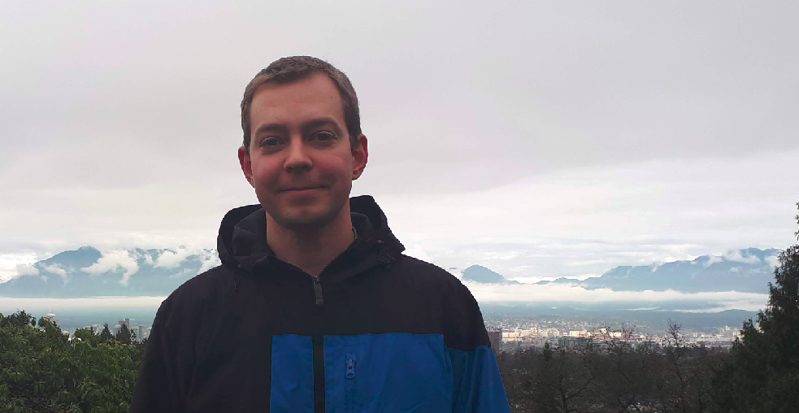
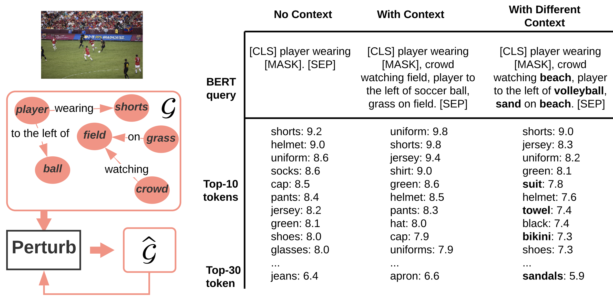
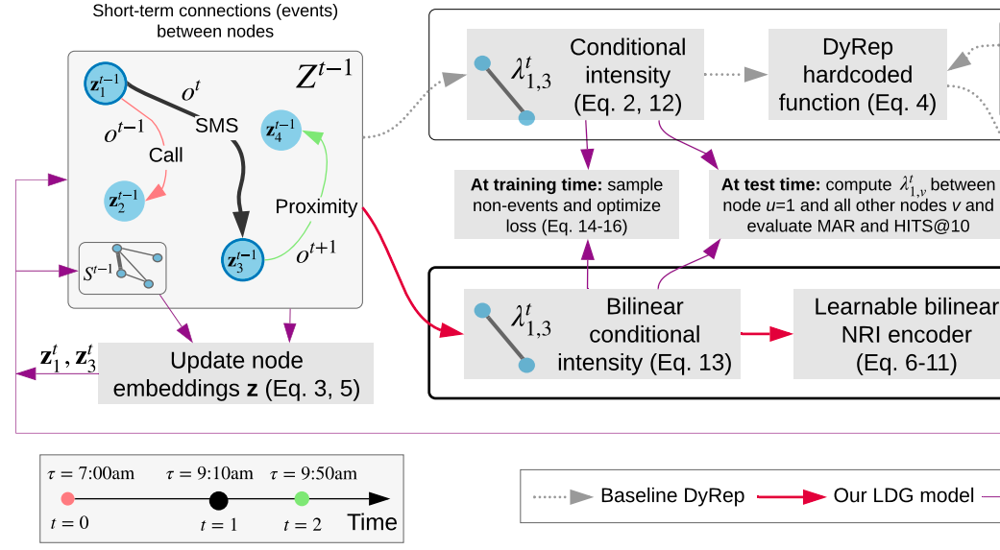
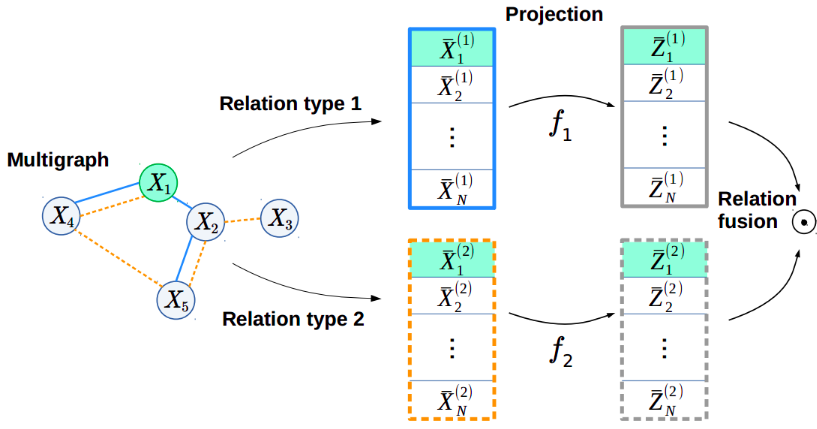
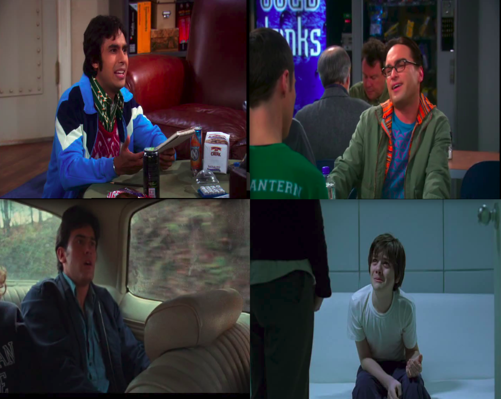
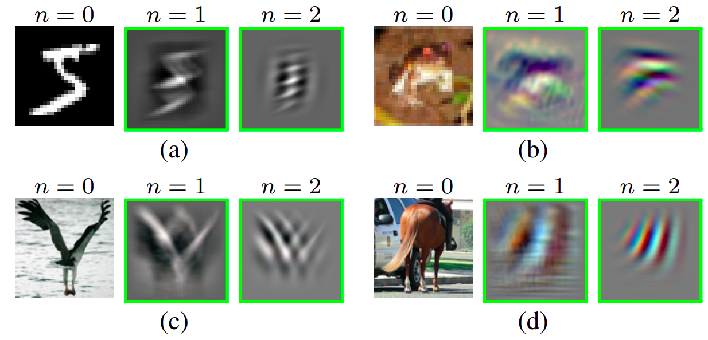

---
#
# By default, content added below the "---" mark will appear in the home page
# between the top bar and the list of recent posts.
# To change the home page layout, edit the _layouts/home.html file.
# See: https://jekyllrb.com/docs/themes/#overriding-theme-defaults
#
layout: home
title: Boris Knyazev
---

## About me

I'm a PhD student at the Machine Learning Research Group, University of Guelph (Ontario, Canada). 
My advisor is [Graham Taylor](https://www.gwtaylor.ca/). Recently, I interned at Mila working with [Eugene Belilovsky](http://eugenium.github.io/) and [Aaron Courville](https://mila.quebec/en/person/aaron-courville/). My research interests lie at the intersection of graph neural networks (GNNs) and computer vision. Previously, I did an internship at SRI International with [Mohamed Amer](https://mohamedramer.com/), where I worked on training GNNs on image superpixels (presented at BMVC 2019).
Before that I worked on unsupervised learning and pretraining of neural networks, face, emotion and facial attributes recognition, and video recognition.

bknyazev [at] uoguelph [dot] ca

## News

- 1 paper accepted at [ICML Workshop on Object-Oriented Learning (OOL): Perception, Representation, and Reasoning, 2020](https://oolworkshop.github.io/program/ool_21.html)
- New [preprint is available](https://arxiv.org/abs/2005.08230)
- 1 paper accepted at **NeurIPS 2019**
- Our work on [Understanding Attention in Graph Neural Networks](https://rlgm.github.io/papers/54.pdf) is accepted as a contributed talk (3 out of 69) at [ICLR Workshop on Representation Learning on Graphs and Manifolds, 2019](https://rlgm.github.io/papers/)
- 1 paper accepted at **BMVC 2019**
- Our poster "Graph Networks for Vision" is selected as the top-2 poster at SRI International among all interns, August 2018

## Talks

- Understanding Attention and Generalization in Graph Neural Networks, [Mila](https://mila.quebec/), Nov 2019 ([slides](https://drive.google.com/open?id=1HcmhSEnf8ll6-BxXK1PiGzcXDa6BbKnC))
- Video Recognition, [Universität zu Lübeck](https://www.inb.uni-luebeck.de/home.html), Jan 2016 ([slides](https://drive.google.com/file/d/1zQBsY2O9a9w7to9toiu1xNbnBxqnsyqi/view?usp=sharing))
- Resource Efficient Features, [Universität zu Lübeck](https://www.inb.uni-luebeck.de/home.html), Oct 2015

## Publications
See the full list at [Google Scholar](https://scholar.google.ca/citations?user=Dp9VFB0AAAAJ&hl).

- **Generative Graph Perturbations for Scene Graph Prediction** 
Boris Knyazev, Harm de Vries, Cătălina Cangea, Graham W. Taylor, Aaron Courville, Eugene Belilovsky  ICML Workshop on Object-Oriented Learning (OOL): Perception, Representation, and Reasoning, 2020  [html](https://arxiv.org/abs/2007.05756), [pdf](https://arxiv.org/pdf/2007.05756.pdf), [video](https://oolworkshop.github.io/program/ool_21.html)

- **Graph Density-Aware Losses for Novel Compositions in Scene Graph Generation** 
Boris Knyazev, Harm de Vries, Cătălina Cangea, Graham W. Taylor, Aaron Courville, Eugene Belilovsky  *in submission* [html](https://arxiv.org/abs/2005.08230), [pdf](https://arxiv.org/pdf/2005.08230.pdf), [code](https://github.com/bknyaz/sgg)

- **Learning Temporal Attention in Dynamic Graphs with Bilinear Interactions** 
Boris Knyazev\*, Carolyn Augusta\*, Graham Taylor (\*equal contribution)  *in submission*  [html](https://arxiv.org/abs/1909.10367), [pdf](https://arxiv.org/pdf/1909.10367.pdf), [code](https://github.com/uoguelph-mlrg/LDG)

- **Understanding Attention and Generalization in Graph Neural Networks**  Boris Knyazev, Graham Taylor, Mohamed Amer  Advances in Neural Information Processing Systems (**NeurIPS**), 2019  [html](https://papers.nips.cc/paper/8673-understanding-attention-and-generalization-in-graph-neural-networks), [pdf](https://papers.nips.cc/paper/8673-understanding-attention-and-generalization-in-graph-neural-networks.pdf), [ICLR workshop version](https://rlgm.github.io/papers/54.pdf), [code](https://github.com/bknyaz/graph_attention_pool), [poster](https://drive.google.com/open?id=1COefg8JADh7mgI1uh0vB6euadpOmjH27), [slides](https://drive.google.com/open?id=1HcmhSEnf8ll6-BxXK1PiGzcXDa6BbKnC)

- **Image Classification with Hierarchical Multigraph Networks**  Boris Knyazev, Xiao Lin, Mohamed Amer, Graham Taylor  British Machine Vision Conference (**BMVC**), 2019  [html](https://arxiv.org/abs/1907.09000), [pdf](https://arxiv.org/pdf/1907.09000.pdf), [code](https://github.com/bknyaz/bmvc_2019), [blog post](https://towardsdatascience.com/can-we-do-better-than-convolutional-neural-networks-46ed90fed807)

- **Spectral Multigraph Networks for Discovering and Fusing Relationships in Molecules**  Boris Knyazev, Xiao Lin, Mohamed Amer, Graham Taylor **NeurIPS Workshop** on Machine Learning for Molecules and Materials, 2018  [html](https://arxiv.org/abs/1811.09595), [pdf](https://arxiv.org/pdf/1811.09595.pdf), [code](https://github.com/bknyaz/graph_nn)

- **Leveraging Large Face Recognition Data for Emotion Classification** Boris Knyazev, Roman Shvetsov, Natalia Efremova, Artem Kuharenko **FG Workshop** on Large-scale Emotion Recognition and Analysis (LERA), 2018 
[html](https://arxiv.org/abs/1711.04598), [pdf](https://arxiv.org/pdf/1711.04598.pdf), [code](https://github.com/bknyaz/emotiw), [Top-2 in EmotiW 2017 challenge](https://sites.google.com/site/emotiwchallenge/)

- **Recursive Autoconvolution for Unsupervised Learning of Convolutional Neural Networks**  Boris Knyazev, Erhardt Barth, Thomas Martinetz  International Joint Conference on Neural Networks (**IJCNN**), 2017 [html](https://arxiv.org/abs/1606.00611), [pdf](https://arxiv.org/pdf/1606.00611.pdf), [matlab code](https://github.com/bknyaz/autocnn_unsup), [python code](https://github.com/bknyaz/autocnn_unsup_py), [reddit](https://www.reddit.com/r/MachineLearning/comments/bgegk0/recursive_autoconvolution_for_unsupervised/)

## Blog posts

- **[Tutorial on Graph Neural Networks for Computer Vision and Beyond](https://medium.com/@BorisAKnyazev/tutorial-on-graph-neural-networks-for-computer-vision-and-beyond-part-1-3d9fada3b80d)**

- **[Anisotropic, Dynamic, Spectral and Multiscale Filters Defined on Graphs](https://towardsdatascience.com/tutorial-on-graph-neural-networks-for-computer-vision-and-beyond-part-2-be6d71d70f49)**

- **[Spectral Graph Convolution Explained and Implemented Step By Step](https://towardsdatascience.com/spectral-graph-convolution-explained-and-implemented-step-by-step-2e495b57f801)**

- **[Can we do better than Convolutional Neural Networks?](https://towardsdatascience.com/can-we-do-better-than-convolutional-neural-networks-46ed90fed807)**

## Open source contributions

-  - Geometric Deep Learning Extension Library for PyTorch
