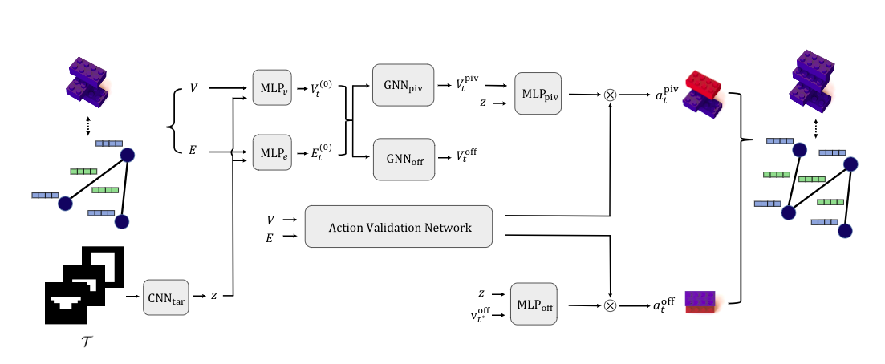
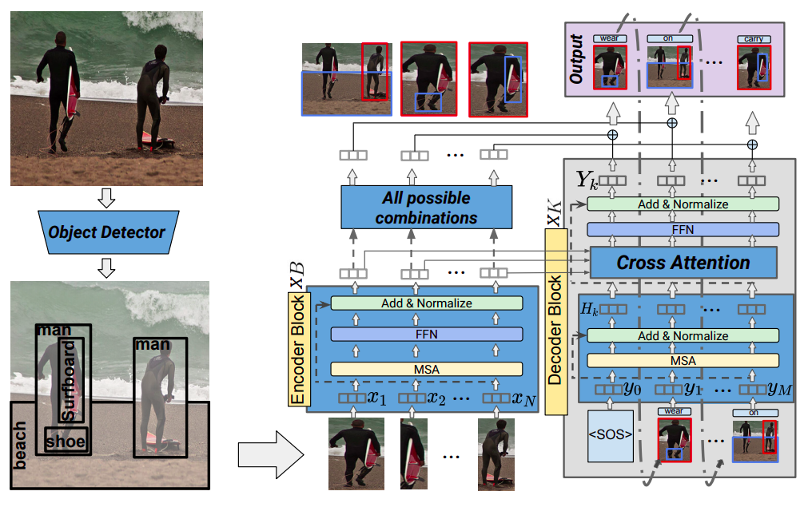
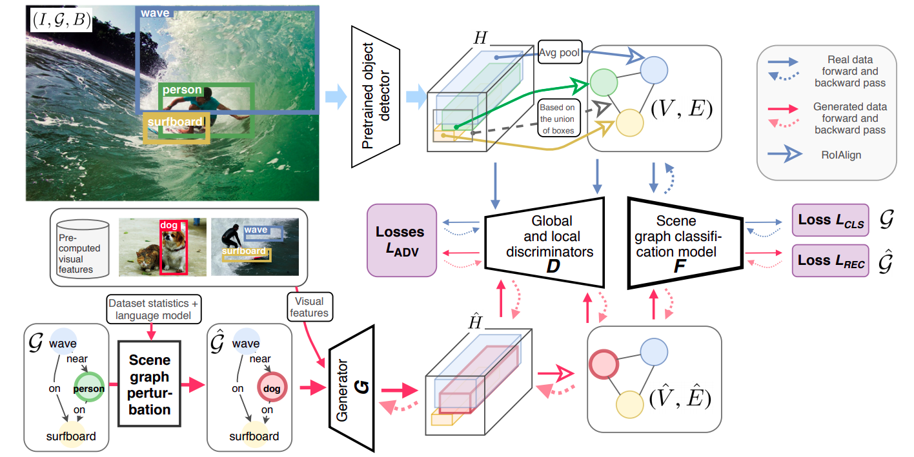

---
#
# By default, content added below the "---" mark will appear in the home page
# between the top bar and the list of recent posts.
# To change the home page layout, edit the _layouts/home.html file.
# See: https://jekyllrb.com/docs/themes/#overriding-theme-defaults
#
layout: home
title: Boris Knyazev
---

## About me

I'm a Research Scientist at [Samsung - SAIT AI Lab](https://www.sait.samsung.co.kr/saithome/about/labs.do). I completed my PhD at the Machine Learning Research Group, [University of Guelph](https://uoguelph.ca/) and [Vector Institute](https://vectorinstitute.ai/) under supervision of [Graham Taylor](https://www.gwtaylor.ca/) in 2022. My research interests lie at the intersection of graph neural networks (GNNs), computer vision and meta-learning.
In the past I interned at Facebook AI Research (FAIR) working with [‪Adriana Romero](https://sites.google.com/site/adriromsor/) and Michal Drozdzal on [parameter prediction for neural networks](https://github.com/facebookresearch/ppuda). 
I also interned at Mila working with [Eugene Belilovsky](http://eugenium.github.io/) and [Aaron Courville](https://mila.quebec/en/person/aaron-courville/) on [visual compositional generalization](https://github.com/bknyaz/sgg). I also interned at SRI International with [Mohamed Amer](https://mohamedramer.com/), where I worked on [training GNNs on image superpixels](https://github.com/bknyaz/bmvc_2019).
Before starting my PhD, I worked on unsupervised learning and pretraining of neural networks, face, emotion and facial attributes recognition, and video recognition.

## News

- new preprint (NiNo) is available [pdf](papers/nino_paper.pdf), [arXiv](https://arxiv.org/abs/2409.04434), [code](https://github.com/SamsungSAILMontreal/nino)
- 1 paper accepted as **oral** at **ICLR 2024** [openreview](https://openreview.net/forum?id=oO6FsMyDBt), [arXiv](https://arxiv.org/abs/2403.12143), [code](https://github.com/mkofinas/neural-graphs), [twitter](https://twitter.com/MiltosKofinas/status/1770881928540963177)
- 1 paper is accepted at **NeurIPS 2023 workshop** [Learning Optimizers for Local SGD](https://openreview.net/forum?id=HiPe4SjZMs)
- 2 papers are accepted at **ICML 2023 workshops** [LLMs for Graphs](https://openreview.net/forum?id=LfCzmmnH4L), [Learning to Optimize](https://openreview.net/forum?id=MusMaHCrs2)
- 1 paper accepted at **ICML 2023** [arXiv](https://arxiv.org/abs/2303.04143), [code](https://github.com/SamsungSAILMontreal/ghn3)
- 1 paper accepted at **NeurIPS 2022 Track Datasets and Benchmarks** ([openreview](https://openreview.net/forum?id=MOCZI3h8Ye), [arXiv](https://arxiv.org/abs/2209.14764), [dataset](https://github.com/ModelZoos/ModelZooDataset))
- 1 paper accepted at **NeurIPS 2022** ([arXiv](https://arxiv.org/abs/2209.14733), [NeurIPS](https://nips.cc/Conferences/2022/Schedule?showEvent=53429))
- My PhD thesis has been approved and is available [online](https://atrium.lib.uoguelph.ca/xmlui/handle/10214/26824), [LateX source](https://github.com/uoguelph-mlrg/phdthesis_boris)
- 1 paper accepted at **ICLR 2022** ([openreview](https://openreview.net/forum?id=EnwCZixjSh), [arXiv](https://arxiv.org/abs/2201.09871), [code](https://github.com/uoguelph-mlrg/GGM-metrics))
- 2 out of 2 papers accepted at **NeurIPS 2021**
- Selected as an "Outstanding Reviewer" for **ICCV 2021** (top 5% student reviewers)
- 2 out of 2 papers accepted at **ICCV 2021**

## Reviewing

- 2024: ICML, Neural Networks
- 2023: ICML, NeurIPs, MLG @ KDD, ICLR
- 2022: CVPR, ICML, ICML Workshop, NeurIPS, Learning on Graphs Conference (LoG), Nature Machine Intelligence
- 2021: ICCV
- 2020: BMVC,  [ICML Workshop on Graph Representation Learning and Beyond](https://grlplus.github.io/)

## Publications

See the full list at [Google Scholar](https://scholar.google.ca/citations?user=Dp9VFB0AAAAJ&hl).

- **Parameter Prediction for Unseen Deep Architectures** 
Boris Knyazev, Michal Drozdzal, Graham W. Taylor, Adriana Romero-Soriano 
Advances in Neural Information Processing Systems (**NeurIPS**), 2021  
[html](https://arxiv.org/abs/2110.13100), [pdf](papers/ppuda_neurips2021.pdf), [reviews](https://openreview.net/forum?id=vqHak8NLk25), [UofG news](https://news.uoguelph.ca/2022/01/u-of-g-engineers-share-benefits-of-machine-learning-advance/), [Yannic Kilcher's video](https://youtu.be/3HUK2UWzlFA), [neurips video](https://recorder-v3.slideslive.com/?share=48783&s=9eaa2f2d-b9a5-4d7e-a127-98d96f52ff49), [code](https://github.com/facebookresearch/ppuda), [Colab-predict](https://colab.research.google.com/drive/1fU0JU6p73QThJiakFPLNoOmkbDEYw2xf?usp=sharing), [Colab-fine-tune](https://colab.research.google.com/drive/1IH86johwAmwkyLv7KQgg23IptD6JkEqe?usp=sharing), [twitter](https://twitter.com/BorisAKnyazev/status/1452813952719761416), [quantamagazine](https://www.quantamagazine.org/researchers-build-ai-that-builds-ai-20220125/)

- **Brick-by-Brick: Combinatorial Construction with Deep Reinforcement Learning** 
Hyunsoo Chung, Jungtaek Kim, Boris Knyazev, Jinhwi Lee, Graham W. Taylor, Jaesik Park, Minsu Cho  
Advances in Neural Information Processing Systems (**NeurIPS**), 2021  
[html](https://arxiv.org/abs/2110.15481), [pdf](https://arxiv.org/pdf/2110.15481.pdf), [reviews](https://openreview.net/forum?id=c1p817YZAx6), [video](https://recorder-v3.slideslive.com/#/share?share=50391&s=83fe5538-73e2-4001-874e-cc36c6ded861), [code](https://github.com/POSTECH-CVLab/Brick-by-Brick)

- **Context-aware Scene Graph Generation with Seq2Seq Transformers** 
Yichao Lu, Himanshu Rai, Jason Chang, Boris Knyazev, Shashank Shekhar, Graham W. Taylor, Maksims Volkovs  
International Conference on Computer Vision (**ICCV**), 2021  
[html](https://openaccess.thecvf.com/content/ICCV2021/html/Lu_Context-Aware_Scene_Graph_Generation_With_Seq2Seq_Transformers_ICCV_2021_paper.html), [pdf](http://www.cs.utoronto.ca/~mvolkovs/ICCV2021_Transformer_SGG.pdf), [code](https://github.com/layer6ai-labs/SGG-Seq2Seq)

- **Generative Compositional Augmentations for Scene Graph Prediction** 
Boris Knyazev, Harm de Vries, Cătălina Cangea, Graham W. Taylor, Aaron Courville, Eugene Belilovsky  
International Conference on Computer Vision (**ICCV**), 2021   
[html](https://arxiv.org/abs/2007.05756), [pdf](https://arxiv.org/pdf/2007.05756.pdf), [ICML Workshop version](https://github.com/oolworkshop/oolworkshop.github.io/blob/master/pdf/OOL_21.pdf), [ICML workshop video](https://oolworkshop.github.io/program/ool_21.html), [ICCV code](https://github.com/bknyaz/sgg)

- **Graph Density-Aware Losses for Novel Compositions in Scene Graph Generation** 
Boris Knyazev, Harm de Vries, Cătălina Cangea, Graham W. Taylor, Aaron Courville, Eugene Belilovsky  British Machine Vision Conference (**BMVC**), 2020  [html](https://arxiv.org/abs/2005.08230), [pdf](https://arxiv.org/pdf/2005.08230.pdf), [bmvc](https://www.bmvc2020-conference.com/conference/papers/paper_0378.html), [code](https://github.com/bknyaz/sgg), [Data Fest tutorial](https://www.youtube.com/watch?v=tMLj9TcLgPg)

- **Learning Temporal Attention in Dynamic Graphs with Bilinear Interactions** 
Boris Knyazev\*, Carolyn Augusta\*, Graham Taylor (\*equal contribution)  **PLOS ONE**, 2021   [html](https://arxiv.org/abs/1909.10367), [pdf](https://arxiv.org/pdf/1909.10367.pdf), [plos one journal link](https://journals.plos.org/plosone/article?id=10.1371/journal.pone.0247936), [code](https://github.com/uoguelph-mlrg/LDG)

- **Understanding Attention and Generalization in Graph Neural Networks**  Boris Knyazev, Graham Taylor, Mohamed Amer  Advances in Neural Information Processing Systems (**NeurIPS**), 2019  [html](https://arxiv.org/abs/1905.02850), [pdf](https://arxiv.org/pdf/1905.02850.pdf), [neurips](https://papers.nips.cc/paper/8673-understanding-attention-and-generalization-in-graph-neural-networks), [ICLR Workshop version](https://rlgm.github.io/papers/54.pdf), [code](https://github.com/bknyaz/graph_attention_pool), [poster](https://drive.google.com/open?id=1COefg8JADh7mgI1uh0vB6euadpOmjH27), [slides](https://drive.google.com/open?id=1HcmhSEnf8ll6-BxXK1PiGzcXDa6BbKnC)

- **Image Classification with Hierarchical Multigraph Networks**  Boris Knyazev, Xiao Lin, Mohamed Amer, Graham Taylor  British Machine Vision Conference (**BMVC**), 2019  [html](https://arxiv.org/abs/1907.09000), [pdf](https://arxiv.org/pdf/1907.09000.pdf), [bmvc pdf](https://bmvc2019.org/wp-content/uploads/papers/1186-paper.pdf), [code](https://github.com/bknyaz/bmvc_2019), [blog post](https://towardsdatascience.com/can-we-do-better-than-convolutional-neural-networks-46ed90fed807)

- **Spectral Multigraph Networks for Discovering and Fusing Relationships in Molecules**  Boris Knyazev, Xiao Lin, Mohamed Amer, Graham Taylor **NeurIPS Workshop** on Machine Learning for Molecules and Materials, 2018  [html](https://arxiv.org/abs/1811.09595), [pdf](https://arxiv.org/pdf/1811.09595.pdf), [code](https://github.com/bknyaz/graph_nn)

- **Leveraging Large Face Recognition Data for Emotion Classification** Boris Knyazev, Roman Shvetsov, Natalia Efremova, Artem Kuharenko **FG Workshop** on Large-scale Emotion Recognition and Analysis (LERA), 2018 
[html](https://arxiv.org/abs/1711.04598), [pdf](https://arxiv.org/pdf/1711.04598.pdf), [code](https://github.com/bknyaz/emotiw), [Top-2 in EmotiW 2017 challenge](https://sites.google.com/site/emotiwchallenge/)

- **Recursive Autoconvolution for Unsupervised Learning of Convolutional Neural Networks**  Boris Knyazev, Erhardt Barth, Thomas Martinetz  International Joint Conference on Neural Networks (**IJCNN**), 2017 [html](https://arxiv.org/abs/1606.00611), [pdf](https://arxiv.org/pdf/1606.00611.pdf), [matlab code](https://github.com/bknyaz/autocnn_unsup), [python code](https://github.com/bknyaz/autocnn_unsup_py), [reddit](https://www.reddit.com/r/MachineLearning/comments/bgegk0/recursive_autoconvolution_for_unsupervised/)

## Blog posts

- **[Tutorial on Graph Neural Networks for Computer Vision and Beyond](https://medium.com/@BorisAKnyazev/tutorial-on-graph-neural-networks-for-computer-vision-and-beyond-part-1-3d9fada3b80d)**

- **[Anisotropic, Dynamic, Spectral and Multiscale Filters Defined on Graphs](https://towardsdatascience.com/tutorial-on-graph-neural-networks-for-computer-vision-and-beyond-part-2-be6d71d70f49)**

- **[Spectral Graph Convolution Explained and Implemented Step By Step](https://towardsdatascience.com/spectral-graph-convolution-explained-and-implemented-step-by-step-2e495b57f801)**

- **[Can we do better than Convolutional Neural Networks?](https://towardsdatascience.com/can-we-do-better-than-convolutional-neural-networks-46ed90fed807)**

## Open source contributions

-  - Geometric Deep Learning Extension Library for PyTorch

## Extracurricular interests

- Sports (basketball, tennis, snowboarding, mountain hiking)
- Chess
- Traveling

Last updated: Sep 13, 2024
