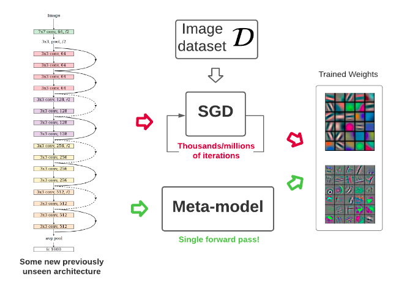

---
#
# By default, content added below the "---" mark will appear in the home page
# between the top bar and the list of recent posts.
# To change the home page layout, edit the _layouts/home.html file.
# See: https://jekyllrb.com/docs/themes/#overriding-theme-defaults
#
layout: home
title: Boris Knyazev
---

## About me

I'm a Research Scientist at [Samsung - SAIT AI Lab](https://www.sait.samsung.co.kr/saithome/about/labs.do) 
and **Adjunct Professor** at the University of Montreal.
I completed my PhD at the Machine Learning Research Group, 
[University of Guelph](https://uoguelph.ca/) and [Vector Institute](https://vectorinstitute.ai/) under supervision of [Graham Taylor](https://www.gwtaylor.ca/) in 2022. 
My research interests include 
**graph neural networks (GNNs)**, 
**large (language) models (LLMs)**,
**optimization** and **meta-learning** with applications to 
computer vision, 
language modeling and 
molecule discovery.

## Prospective students
I do not yet have funding for students, but I am open to supervising graduate students. 
Topics include: [neural network weight representation](https://weight-space-learning.github.io/), learning to optimize, 
LLMs and GNNs for scientific discovery, compressing and merging large models.
Please <a href="mailto:boris.knyazev@umontreal.ca" class="author-social" target="_blank"><i class="fa fa-fw fa-envelope-square"></i> email me </a> if you are interested.

## News

- _Aug 2025_: [(Almost) Free Modality Stitching of Foundation Models](https://arxiv.org/abs/2507.10015) accepted to **EMNLP 2025**  (Main Conference)
- _May 2025_: [Celo: Training Versatile Learned Optimizers on a Compute Diet](https://arxiv.org/abs/2501.12670) accepted to **TMLR** ([tmlr](https://openreview.net/forum?id=SLqJbt4emY))
- _Apr 2025_: Gave an invited talk at the [ICLR 2025 Workshop on Weight Space Learning](https://weight-space-learning.github.io/), see [slides](talks/iclr2025_workshop_talk_boris.pdf) and [talk](https://iclr.cc/virtual/2025/10000308)
- _Mar 2025_: [Meta-learning Optimizers for Communication-Efficient Learning](https://openreview.net/forum?id=uRbf9ANAns) accepted to **TMLR** ([tmlr](https://openreview.net/forum?id=uRbf9ANAns))
- _Feb 2025_: Became **Adjunct Professor** at the University of Montreal
- _Jan 2025_: [NiNo](https://arxiv.org/abs/2409.04434) accepted at **ICLR 2025**

- _Dec 2024_: Invited as a speaker at [ICLR 2025 Workshop on Weight Space Learning](https://weight-space-learning.github.io/)
- _Oct 2024_: [µLO](https://arxiv.org/abs/2406.00153) accepted as **oral** at **OPT for ML 2024 NeurIPS Workshop**, congrats Benjamin and Charles-Étienne!
- _Feb 2024_: [Neural Graphs](https://arxiv.org/abs/2403.12143) accepted as **oral** at **ICLR 2024**, congrats Miltos!

- _Oct 2023_: [Learning Optimizers for Local SGD](https://openreview.net/forum?id=HiPe4SjZMs) accepted at **NeurIPS 2023 Workshop on Federated Learning**
- _Jun 2023_: 2 papers accepted at **ICML 2023 Workshops** ([LLMs for Graphs](https://openreview.net/forum?id=LfCzmmnH4L), [Learning to Optimize](https://openreview.net/forum?id=MusMaHCrs2))
- _Apr 2023_: [GHN-3](https://arxiv.org/abs/2303.04143) accepted at **ICML 2023**

- _Sep 2022_: [Model Zoos](https://arxiv.org/abs/2209.14764) accepted at **NeurIPS 2022 Track Datasets and Benchmarks**
- _Sep 2022_: [Hyper-Representations](https://arxiv.org/abs/2209.14733) accepted at **NeurIPS 2022**
- _Mar 2022_: My PhD thesis has been approved and is available [online](https://atrium.lib.uoguelph.ca/xmlui/handle/10214/26824) ([LateX source](https://github.com/uoguelph-mlrg/phdthesis_boris))
- _Jan 2022_: [On Evaluation Metrics for Graph Generative Models](https://arxiv.org/abs/2201.09871) accepted at **ICLR 2022**

- _Sep 2021_: 2 out of 2 papers accepted at **NeurIPS 2021**
- _Aug 2021_: Selected as an "Outstanding Reviewer" for **ICCV 2021** (top 5% student reviewers)
- _Jul 2021_: 2 out of 2 papers accepted at **ICCV 2021**

## Reviewing

- 2024: ICML, NeurIPS, ICLR, Neural Networks
- 2023: ICML, NeurIPs, MLG @ KDD, ICLR
- 2022: CVPR, ICML, ICML Workshop, NeurIPS, Learning on Graphs Conference (LoG), Nature Machine Intelligence
- 2021: ICCV (**Outstanding Reviewer**, top 5% student reviewers)
- 2020: BMVC,  [ICML Workshop on Graph Representation Learning and Beyond](https://grlplus.github.io/)

## Selected publications

See the full list at [Google Scholar](https://scholar.google.ca/citations?user=Dp9VFB0AAAAJ&hl).

- **Accelerating training with neuron interaction and nowcasting networks** 
Boris Knyazev, Abhinav Moudgil, Guillaume Lajoie, Eugene Belilovsky, Simon Lacoste-Julien 
International Conference on Learning Representations (**ICLR**), 2025 
[openreview](https://openreview.net/forum?id=oO6FsMyDBt), [arxiv](https://arxiv.org/abs/2409.04434), [code](https://github.com/SamsungSAILMontreal/nino), [poster](https://iclr.cc/media/PosterPDFs/ICLR%202025/29046.png?t=1744120772.4784477), [twitter](https://x.com/BorisAKnyazev/status/1834676330174005421)

- **Graph Neural Networks for Learning Equivariant Representations of Neural Networks** 
Miltiadis Kofinas, Boris Knyazev, Yan Zhang, Yunlu Chen, Gertjan J Burghouts, Efstratios Gavves, Cees GM Snoek, David W Zhang 
International Conference on Learning Representations (**ICLR**), 2024 (**oral**) 
[openreview](https://openreview.net/forum?id=oO6FsMyDBt), [arxiv](https://arxiv.org/abs/2403.12143), [code](https://github.com/mkofinas/neural-graphs), [twitter](https://twitter.com/MiltosKofinas/status/1770881928540963177)

- **Can We Scale Transformers to Predict Parameters of Diverse ImageNet Models?** 
Boris Knyazev, Doha Hwang, Simon Lacoste-Julien 
International Conference on Machine Learning (**ICML**), 2023 
[arxiv](https://arxiv.org/abs/2303.04143), [video](https://icml.cc/virtual/2023/poster/24569), [code](https://github.com/SamsungSAILMontreal/ghn3)

- **Hyper-Representations as Generative Models: Sampling Unseen Neural Network Weights** 
Konstantin Schürholt, Boris Knyazev, Xavier Giró-i-Nieto, Damian Borth 
Advances in Neural Information Processing Systems (**NeurIPS**), 2022 
[arxiv](https://arxiv.org/abs/2209.14733), [slides](https://nips.cc/Conferences/2022/Schedule?showEvent=53429), [code](https://github.com/HSG-AIML/NeurIPS_2022-Generative_Hyper_Representations)

- **On Evaluation Metrics for Graph Generative Models** 
Rylee Thompson, Boris Knyazev, Elahe Ghalebi, Jungtaek Kim, Graham W Taylor 
International Conference on Learning Representations (**ICLR**), 2022 
[openreview](https://openreview.net/forum?id=EnwCZixjSh), [arxiv](https://arxiv.org/abs/2201.09871), [code](https://github.com/uoguelph-mlrg/GGM-metrics)

- **Parameter Prediction for Unseen Deep Architectures** 
Boris Knyazev, Michal Drozdzal, Graham W. Taylor, Adriana Romero-Soriano 
Advances in Neural Information Processing Systems (**NeurIPS**), 2021 
[openreview](https://openreview.net/forum?id=vqHak8NLk25), [arxiv](https://arxiv.org/abs/2110.13100), [UofG news](https://news.uoguelph.ca/2022/01/u-of-g-engineers-share-benefits-of-machine-learning-advance/), [Yannic Kilcher's video](https://youtu.be/3HUK2UWzlFA), [neurips video](https://recorder-v3.slideslive.com/?share=48783&s=9eaa2f2d-b9a5-4d7e-a127-98d96f52ff49), [code](https://github.com/facebookresearch/ppuda), [Colab-predict](https://colab.research.google.com/drive/1fU0JU6p73QThJiakFPLNoOmkbDEYw2xf?usp=sharing), [Colab-fine-tune](https://colab.research.google.com/drive/1IH86johwAmwkyLv7KQgg23IptD6JkEqe?usp=sharing), [twitter](https://twitter.com/BorisAKnyazev/status/1452813952719761416), [quantamagazine](https://www.quantamagazine.org/researchers-build-ai-that-builds-ai-20220125/)

- **Brick-by-Brick: Combinatorial Construction with Deep Reinforcement Learning** 
Hyunsoo Chung, Jungtaek Kim, Boris Knyazev, Jinhwi Lee, Graham W. Taylor, Jaesik Park, Minsu Cho 
Advances in Neural Information Processing Systems (**NeurIPS**), 2021 
[openreview](https://openreview.net/forum?id=c1p817YZAx6), [arxiv](https://arxiv.org/abs/2110.15481), [video](https://recorder-v3.slideslive.com/#/share?share=50391&s=83fe5538-73e2-4001-874e-cc36c6ded861), [code](https://github.com/POSTECH-CVLab/Brick-by-Brick)

- **Context-aware Scene Graph Generation with Seq2Seq Transformers** 
Yichao Lu, Himanshu Rai, Jason Chang, Boris Knyazev, Shashank Shekhar, Graham W. Taylor, Maksims Volkovs  
International Conference on Computer Vision (**ICCV**), 2021 
[openaccess](https://openaccess.thecvf.com/content/ICCV2021/html/Lu_Context-Aware_Scene_Graph_Generation_With_Seq2Seq_Transformers_ICCV_2021_paper.html), [pdf](http://www.cs.utoronto.ca/~mvolkovs/ICCV2021_Transformer_SGG.pdf), [code](https://github.com/layer6ai-labs/SGG-Seq2Seq)

- **Generative Compositional Augmentations for Scene Graph Prediction** 
Boris Knyazev, Harm de Vries, Cătălina Cangea, Graham W. Taylor, Aaron Courville, Eugene Belilovsky  
International Conference on Computer Vision (**ICCV**), 2021  
[arxiv](https://arxiv.org/abs/2007.05756), [ICML Workshop version](https://github.com/oolworkshop/oolworkshop.github.io/blob/master/pdf/OOL_21.pdf), [ICML workshop video](https://oolworkshop.github.io/program/ool_21.html), [code](https://github.com/bknyaz/sgg)

- **Graph Density-Aware Losses for Novel Compositions in Scene Graph Generation** 
Boris Knyazev, Harm de Vries, Cătălina Cangea, Graham W. Taylor, Aaron Courville, Eugene Belilovsky 
British Machine Vision Conference (**BMVC**), 2020 
[arxiv](https://arxiv.org/abs/2005.08230), [bmvc](https://www.bmvc2020-conference.com/conference/papers/paper_0378.html), [code](https://github.com/bknyaz/sgg), [Data Fest tutorial](https://www.youtube.com/watch?v=tMLj9TcLgPg)

- **Learning Temporal Attention in Dynamic Graphs with Bilinear Interactions** 
Boris Knyazev\*, Carolyn Augusta\*, Graham Taylor (\*equal contribution) 
**PLOS ONE**, 2021 
[arxiv](https://arxiv.org/abs/1909.10367), [plos one journal link](https://journals.plos.org/plosone/article?id=10.1371/journal.pone.0247936), [code](https://github.com/uoguelph-mlrg/LDG)

- **Understanding Attention and Generalization in Graph Neural Networks**  
Boris Knyazev, Graham Taylor, Mohamed Amer  
Advances in Neural Information Processing Systems (**NeurIPS**), 2019 
[arxiv](https://arxiv.org/abs/1905.02850), [neurips](https://papers.nips.cc/paper/8673-understanding-attention-and-generalization-in-graph-neural-networks), [ICLR Workshop version](https://rlgm.github.io/papers/54.pdf), [code](https://github.com/bknyaz/graph_attention_pool), [poster](https://drive.google.com/open?id=1COefg8JADh7mgI1uh0vB6euadpOmjH27), [slides](https://drive.google.com/open?id=1HcmhSEnf8ll6-BxXK1PiGzcXDa6BbKnC)

- **Image Classification with Hierarchical Multigraph Networks** 
Boris Knyazev, Xiao Lin, Mohamed Amer, Graham Taylor 
British Machine Vision Conference (**BMVC**), 2019 
[arxiv](https://arxiv.org/abs/1907.09000), [bmvc pdf](https://bmvc2019.org/wp-content/uploads/papers/1186-paper.pdf), [code](https://github.com/bknyaz/bmvc_2019), [blog post](https://towardsdatascience.com/can-we-do-better-than-convolutional-neural-networks-46ed90fed807)

- **Spectral Multigraph Networks for Discovering and Fusing Relationships in Molecules** 
Boris Knyazev, Xiao Lin, Mohamed Amer, Graham Taylor 
**NeurIPS Workshop** on Machine Learning for Molecules and Materials, 2018 
[arxiv](https://arxiv.org/abs/1811.09595), [code](https://github.com/bknyaz/graph_nn)

- **Leveraging Large Face Recognition Data for Emotion Classification** 
Boris Knyazev, Roman Shvetsov, Natalia Efremova, Artem Kuharenko 
**FG Workshop** on Large-scale Emotion Recognition and Analysis (LERA), 2018 
[arxiv](https://arxiv.org/abs/1711.04598), [code](https://github.com/bknyaz/emotiw), [Top-2 in EmotiW 2017 challenge](https://sites.google.com/site/emotiwchallenge/)

- **Recursive Autoconvolution for Unsupervised Learning of Convolutional Neural Networks** 
Boris Knyazev, Erhardt Barth, Thomas Martinetz 
International Joint Conference on Neural Networks (**IJCNN**), 2017 
[arxiv](https://arxiv.org/abs/1606.00611), [matlab code](https://github.com/bknyaz/autocnn_unsup), [python code](https://github.com/bknyaz/autocnn_unsup_py), [reddit](https://www.reddit.com/r/MachineLearning/comments/bgegk0/recursive_autoconvolution_for_unsupervised/)

## Blog posts

- **[Tutorial on Graph Neural Networks for Computer Vision and Beyond](https://medium.com/@BorisAKnyazev/tutorial-on-graph-neural-networks-for-computer-vision-and-beyond-part-1-3d9fada3b80d)**

- **[Anisotropic, Dynamic, Spectral and Multiscale Filters Defined on Graphs](https://towardsdatascience.com/tutorial-on-graph-neural-networks-for-computer-vision-and-beyond-part-2-be6d71d70f49)**

- **[Spectral Graph Convolution Explained and Implemented Step By Step](https://towardsdatascience.com/spectral-graph-convolution-explained-and-implemented-step-by-step-2e495b57f801)**

- **[Can we do better than Convolutional Neural Networks?](https://towardsdatascience.com/can-we-do-better-than-convolutional-neural-networks-46ed90fed807)**

## Open source contributions

  Geometric Deep Learning Extension Library for PyTorch

## Extracurricular interests

- Sports (basketball, tennis, snowboarding, mountain hiking)
- Chess
- Traveling

Last updated: Sep, 2025
